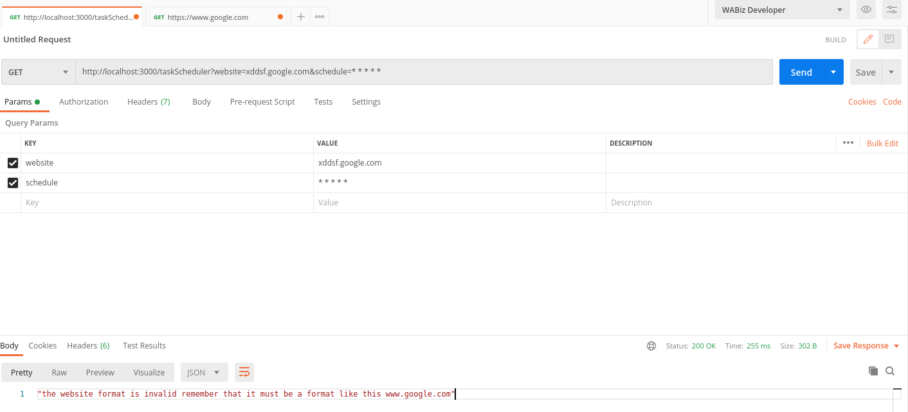

<p align="center">
  <a target="blank"></a>
</p>

## Description

web application that will act as a task scheduler for simple tasks

## Installation

```bash
$ npm i
```

##Requeriments

For the implementation it is necessary to have Node.js installed.

To start the installation of this service it is necessary to execute in the root of the project npm install.

##Execution
```bash
For the initialization of the service, npm start must be executed from the root of the project.

$ npm install 

Note: The API will be running on port 3000 to change it you must modify the bin/www.js file
```

## Running the app

```bash
# development
$ nodemon bin/www.js 

# other
$ node bin/www.js

```
##Test environment

```bash
# successfull case
http://localhost:3000/taskScheduler?website=www.google.com&schedule=* * * * *
```


```bash
# error case 1 for website format
http://localhost:3000/taskScheduler?website=xddsf.google.com&schedule=* * * * *
```



```bash
# error case 2 for cron format
http://localhost:3000/taskScheduler?website=www.google.com&schedule=sdfdsg
```
